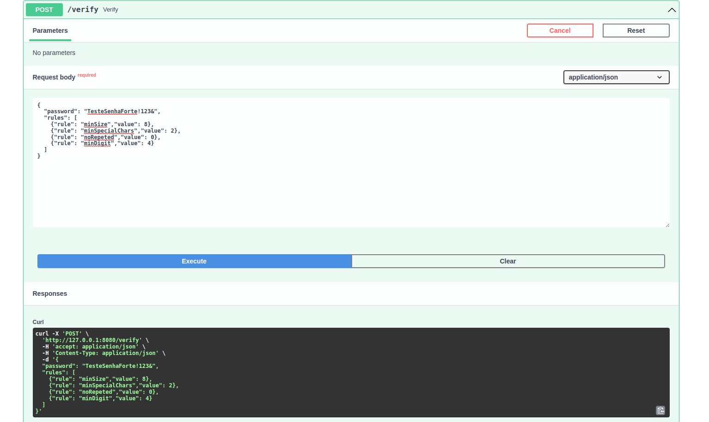
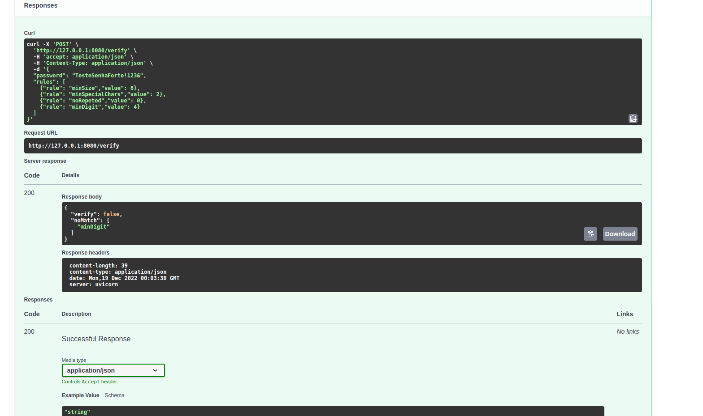

# Projeto Python API

# Contexto
Aplicação para verificação de senha enviada para a rota /verify em um json contendo a senha e as regras a serem seguidas.

## Aplicação rodando

```

´´´

```

´´´

## Técnologias usadas

> Desenvolvido usando: Python3, FatAPI e Uvicorn

## Executando aplicação com Docker 

```
docker build -t verify_password .
```

```
docker run --rm --name verify_password_container verify_password
```

## Executando aplicação sem Docker 

```
python3 -m venv .venv && source .venv/bin/activate && pip install -r requirements.txt
```

```
uvicorn api.main:app --port=8080
```

## Link da documentação da aplicação

http://localhost:8080/docs